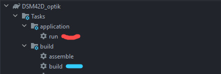

# Descargar el proyecto

1.- Clonar el proyecto

```bash
git clone https://github.com/jonarroh/proyectoIntegrador.git
```

2.-Tener las librerias en la sigueinte ruta

```bash
C:/Librerias
```

3.- Tener en mysql el siguiente usuario

```bash
usuario: root
contraseña: root
```

4.abrir el proyecto en intellij

5.-Esperar a que se descarguen las dependencias

6.-Ejecutar en Task build(azul) y luego en Task run(rojo)


7.- si todo sale bien se debe ver la pantalla de login

~/proyectoIntegrador/proyectoIntegrador